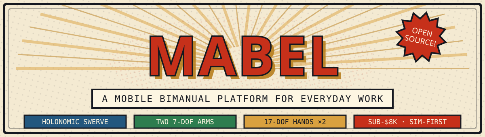

**One robot. Two arms. Thirty-four finger joints. Zero excuses not to build one.**

🌐 **[Visit the project website →](https://robotmabel.github.io/website/)**

---

**MABEL** (*Mobile Anthropomorphic Bimanual Embodiment for Life-like manipulation and
learning*) is an open-source mobile bimanual robot you can actually afford to build: a
holonomic 3-module swerve base, dual 7-DOF arms, two 17-DOF dexterous hands, a lift +
torso for floor-to-tabletop reach, and a 3-DOF head — teleoperated from a Vision Pro,
an iPhone, a browser, or a gamepad, with a full MuJoCo digital twin and a
demonstration-to-deployed-policy learning pipeline.

## 💥 Start here

|   | The panel | What's in it |
|---|---|---|
| 🦴 | **[Build it](https://github.com/robotmabel/MABEL/tree/main/BOM)** | Costed bill of materials + the step-by-step build guide, printable CAD, datasheets |
| 🕹️ | **[Drive it (no hardware needed)](https://github.com/robotmabel/MABEL#quick-start-simulation)** | `bash server/run.sh` → physics + teleop + a browser studio on `:8097` |
| 🧠 | **[Teach it](https://github.com/robotmabel/MABEL/tree/main/learning)** | Record demos → curate → train (ACT / Diffusion / pi0) → deploy, all in-repo |
| 🗺️ | **[Understand it](https://github.com/robotmabel/MABEL#architecture)** | Five data paths, two iron rules, 30+ compiled technical reports |

## 📚 The repos

| Repo | What it is |
|---|---|
| **[MABEL](https://github.com/robotmabel/MABEL)** | The whole robot — hardware, firmware, control, simulation, teleop, learning, docs |
| **[website](https://github.com/robotmabel/website)** | The project site — [robotmabel.github.io/website](https://robotmabel.github.io/website/) |

*Everything ships in one monorepo on purpose: the simulator, the real robot, and every
teleop client speak the same wire contract, so nothing can drift apart.*

---

🛠️ *Built in the open. Runs in sim first. A paper describing the system is under review.*

